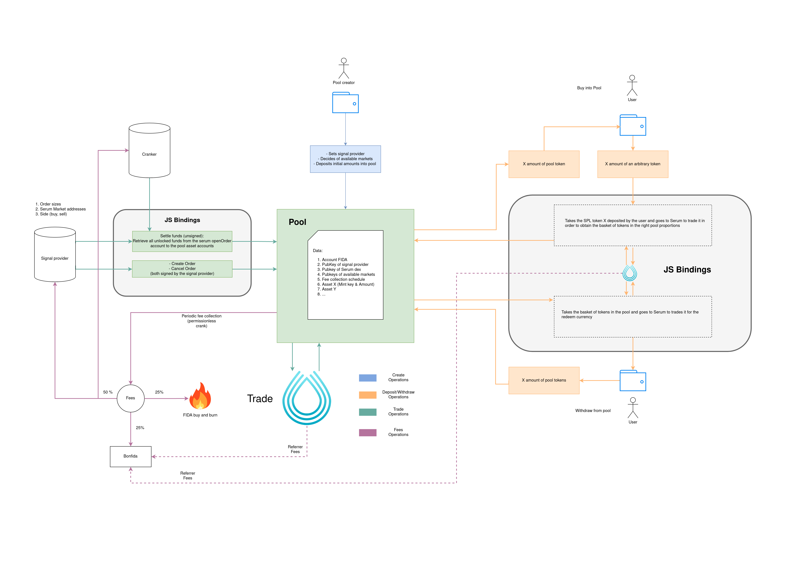

# Bonfida Bot UI

An implementation of a UI for Bonfida Bot.

[Bonfida Bot Tutorial](https://www.youtube.com/watch?v=6BFmyi0qnEI)

Bonfida Bot is hosted on IPFS. Current IPFS CID: **Qmakz1wPEA88eU5WGrwJNH41DsZW41LCN9uWgBYjZpZM2V**

## Running the UI

Run `yarn` to install dependencies, then run `yarn start` to start a development server or `yarn build` to create a production build that can be served by a static file server.

## Bonfida Bot Design and documentation

Bonfida-bot is a an on-chain and off-chain tool suite that enables the creation of trading pools. Each trading pool has a cryptographically identified signal provider who is able to create Serum orders with the pool's assets. Anyone can invest in a trading pool in exchange for specific pool tokens which are redeemable at any time.

### Structure:

- Program account data:

  - Vec of pool tokens accounts addresses (Vec of Pubkeys, owned by program)
  - Pool FIDA account address (Pubkey, owned by program)
  - Signal Provider address (Pubkey)

- Instructions:
  - Initialize Pool:
    - Max number of Markets (u32)
    - Signed by Payer
  - Deposit(initializes the pool if its nonexistent):
    - Pool Seeds (256 bits)
    - Token Mint address (Pubkey)
    - Amount (u64)
    - Signed by Source and Payer
  - Redeem:
    - Pool Seeds (256 bits)
    - Amount of Pooltoken (u64)
    - Payout Token Mint address (Pubkey)
    - Payout Destination token address (Pubkey)
    - Signed by Pool-token owner and Payer
  - Trade (from signal):
    - Pool Seeds (256 bits)
    - Array of order amounts (array of u64)
    - Serum Market address (Pubkey?)
    - Buy/Sell (bool, buy = true)
    - Signed by Signal Provider and Payer

### Diagram:

### JS Bindings

- [JS library repo link](https://github.com/Bonfida/bonfida-bot/tree/main/js)
- [Documentation](https://bonfida.github.io/bonfida-bot-docs/)

## Signal Provider fees

Each pool has a signal provider (i.e a SOL address) that can send trading instruction to the pool. When a signal provider creates a pool he can set up the `feePeriod` and the `feeRate`. The `feeRate` is the amount of pool tokens that will deducted from the pool and paid to the signal provider at every `feePeriod`.

- The signal provider is never directly in control of the pool's asset. They can only issue Serum market orders on behalf of the pool.

- A signal provider is contractually obligated to perform market operations on a specific set of markets which is immutably defined at pool creation. This means that it is impossible for the signal provider to directly extract assets from the pool by creating temporary mock markets which would enable the signal provider from buying the pool's asset under the market price.

- Whereas the pool can itself be in a locked state which locally prevents pool token redeeming as well as investments, it is always possible for anyone to unlock the pool in order to gain access to their funds or just buy in.

## Serum Referral fees

Similar to Serum DEX UI, people who host a Bonfida Bot UI can generate revenues from orders executed from their UI. You can do so by passing your public key as the referral public key for the orders passed on Serum.

To do so, set the `REACT_APP_USDT_REFERRAL_FEES_ADDRESS` and `REACT_APP_USDC_REFERRAL_FEES_ADDRESS` environment variables to the addresses of your USDT and USDC SPL token accounts.

You may want to put these in local environment files (e.g. .env.development.local, .env.production.local). See the [documentation](https://create-react-app.dev/docs/adding-custom-environment-variables) on environment variables for more information.

NOTE: remember to re-build your app before deploying for your referral addresses to be reflected.

## Depolyment

Change `homepage` in `package.json` to make in match with your domain name.

### IPFS

You can host the UI using IPFS `ipfs-deploy`:

- Install `ipfs-deploy`: `yarn global add ipfs-deploy`
- Add the following to `package.json`: `"deploy": "ipfs-deploy build"`
- Deploy: `yarn deploy`

Learn more about `ipfs-deploy` [here](https://github.com/ipfs-shipyard/ipfs-deploy)

### GitHub Pages

You can host the UI using GitHub Pages:

- Install `gh-pages`: `yarn add -D gh-pages`
- Add the following to `package.json`: `"deploy": "gh-pages -d build"`
- Deploy: `yarn deploy`

Learn more about `gh-pages` [here](https://github.com/tschaub/gh-pages)
